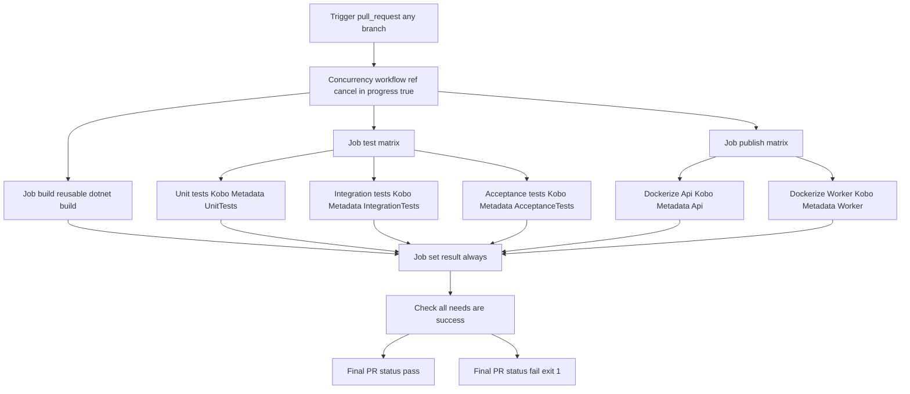
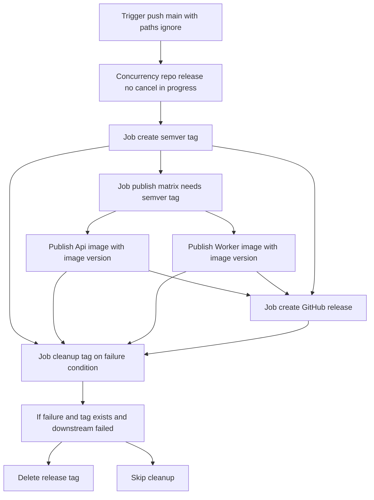
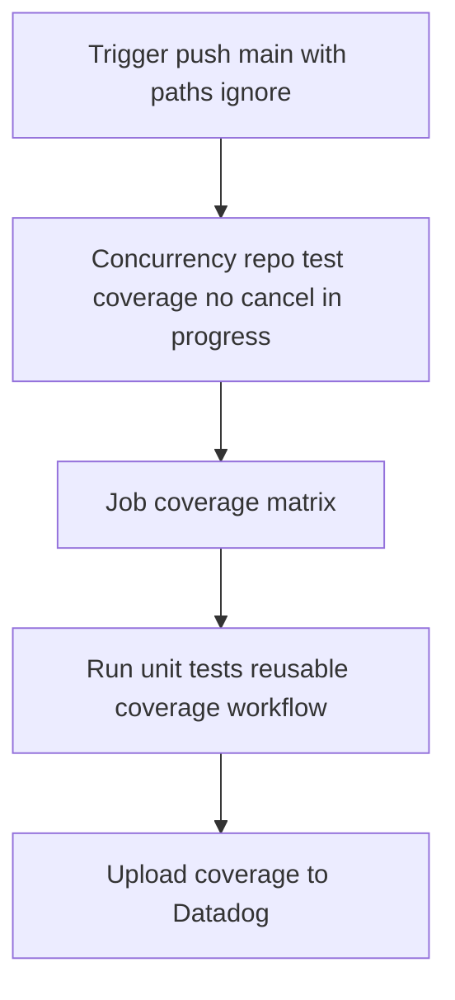
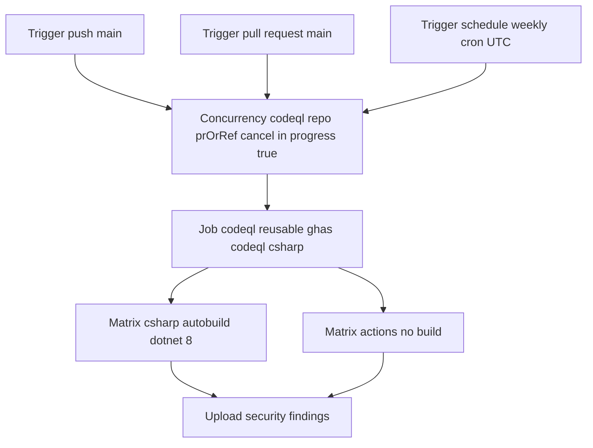
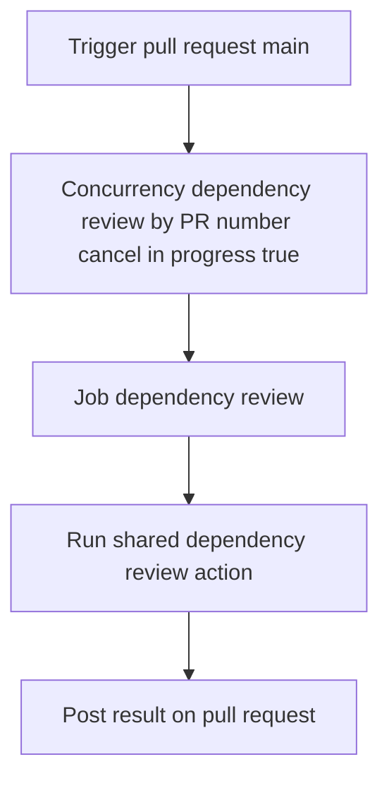
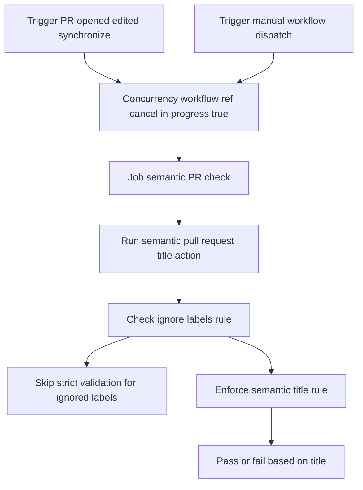

# AI Scenario - Caller Workflows

This document maps the execution logic for each workflow in `caller/`.

## 1) `caller/pr-build.yml`

## 2) `caller/release-build.yml`

## 3) `caller/release-coverage.yml`

## 4) `caller/codeql.yml`

## 5) `caller/dependency-review.yml`

## 6) `caller/pr-format.yml`

## Interview Notes

- Reusable workflows are pinned by commit SHA for reproducibility.
- `secrets: inherit` passes caller secrets into reusable workflows.
- Concurrency differs by scenario:
  - PR workflows cancel stale runs for faster feedback.
  - Release workflows do not cancel in progress runs to protect release integrity.
- Matrix jobs scale horizontally for tests and image publishing.
- Release cleanup logic removes tags when downstream release steps fail.
