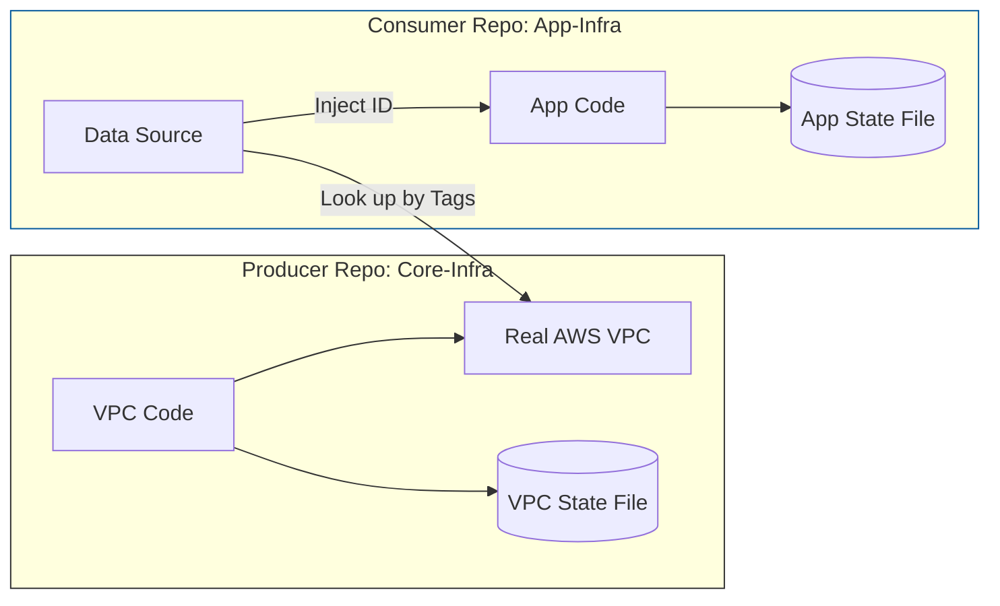
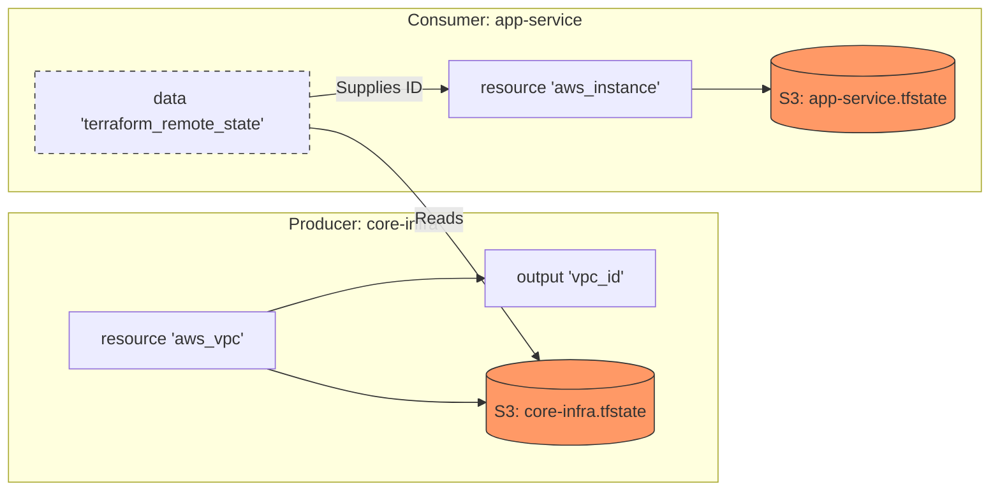

### Data vs Resource
In Terraform, the distinction lies in **ownership**: a `resource` owns the infrastructure (**create, update, or delete**), while a `data` source just visits it(**fetch information**, already exists).

| Feature       | `resource`                                | `data`                                                        |
| ------------- | ----------------------------------------- | ------------------------------------------------------------- |
| **Intent**    | Define and manage infrastructure.         | Fetch attributes of existing infra.                           |
| **Lifecycle** | `Create, Read, Update, Delete (CRUD)`.      | `Read-only`.                                                    |
| **Source**    | Defined by your HCL code.                 | Managed by another team, manual click, or AWS/Azure defaults. |
| **Impact**    | Changing code changes the infrastructure. | Changing code only changes how you reference the info.        |

**Senior Tip:** Use `data` sources to create "contracts" between teams. If the Networking team manages the VPC, your App team should use a `data` source to find the `vpc_id` rather than hardcoding it or trying to manage the VPC `resource` themselves.

### State Separation, Provider vs Comsumer
This mature architectural pattern is **State Separation** or the **Producer-Consumer Model**.

In this setup, you split your infrastructure into two distinct types of repositories:

1. **The Producer Repo (Core Infra):** Manages foundational resources that change slowly (VPCs, Subnets, IAM Roles, Database Clusters).
2. **The Consumer Repo (App/Service Infra):** Manages resources that change frequently (EC2 instances, S3 buckets, Lambda functions) and depend on the Producer's infrastructure.

How they interact via `data`

Since these are separate repositories, they have **separate state files**. The Consumer repo cannot "see" the Producer's code, so it uses **Data Sources** to "discover" the resources.

Example:

**Producer Repo (VPC Team)**

```hcl
resource "aws_vpc" "main" {
  cidr_block = "10.0.0.0/16"
  tags = {
    Name = "production-network" # Tags are critical for discovery
  }
}
```

**Consumer Repo (App Team)**

```hcl
data "aws_vpc" "shared" {
  filter {
    name   = "tag:Name"
    values = ["production-network"]
  }
}

resource "aws_instance" "app" {
  ami           = "ami-12345"
  subnet_id     = data.aws_vpc.shared.id # Consuming the ID
}
```

Why use `data` instead of keeping everything in one repo?

1\. **Separation**: Prevent network setting, accidentally destroy the entire stack
2\. **Clear Ownership** (RBAC)
- **Networking Team:** Has "Write" access to the Producer repo.
- **App Team:** Has "Read-Only" access to the Producer's resources (via data sources) but "Write" access to their own App repo.
3\. Execution **Speed** && Avoiding **"State Locking"**
A repo with 1,000 resources is slow. By splitting them, the App team only manages 50 resources, making their `plan` and `apply` cycles much faster.
4\. Decoupling Lifecycles
Network infrastructure (VPCs) usually lasts for years. Applications might be deployed 10 times a day. Using `data` sources allows the application to move at its own pace without requiring a full run of the core infrastructure code.


Summary of the Flow



### **Remote State Data Sources** (specifically `terraform_remote_state`) 
Using `terraform_remote_state` is a more direct "Senior" approach because it reads the outputs of another state file directly, rather than searching the cloud provider for tags. This creates a hard link between your infrastructure layers.

The Mechanism

Instead of asking AWS "Where is the VPC with this tag?", you ask Terraform "What was the `vpc_id` output the last time the Core-Infra repo ran?"


Comparison: Tags vs. Remote State

| Feature         | Search by Tags (`data "aws_vpc"`)      | Remote State (`terraform_remote_state`)       |
| --------------- | -------------------------------------- | --------------------------------------------- |
| **Coupling**    | Loose (Relies on naming conventions).  | Tight (Relies on State file access).          |
| **Source**      | The Cloud Provider API (AWS/Azure).    | The Terraform State File.                     |
| **Permissions** | Needs "Describe" rights in Cloud.      | Needs Read access to the S3 bucket.           |
| **Reliability** | Someone could change a tag manually.   | Highly reliable; based on exact code outputs. |
| **Complexity**  | Simple; no need to know backend paths. | Higher; requires knowledge of backend config. |

Senior Recommendation:

- Use **Tags** when teams are very separate and you want to maintain "Discovery" without sharing access to state files.
- Use **Remote State** when you own both repos or work in a tightly integrated platform team, as it provides a typed, programmatic contract between layers.

Comparison of the Interaction




To make this architecture clear, here is exactly which code belongs in which repository and how they connect.

1\. Producer Repo: `core-infra`

This repository owns the "Heavy" resources. It **must** export its IDs so others can find them.

**File: `main.tf` (The Resource)**

```hcl
resource "aws_vpc" "main" {
  cidr_block = "10.0.0.0/16"
  tags = { Name = "prod-vpc" }
}

resource "aws_subnet" "public" {
  vpc_id     = aws_vpc.main.id
  cidr_block = "10.0.1.0/24"
}
```

**File: `outputs.tf` (The "Public API" of your state)**

```hcl
output "vpc_id" {
  value = aws_vpc.main.id
}

output "public_subnet_id" {
  value = aws_subnet.public.id
}
```

2\. Consumer Repo: `app-service`

This repository owns the "Light" resources. It **reads** from the Producer but cannot change it.

**File: `data.tf` (The Connection)**

```hcl
# Connects to the Producer's state file in S3
data "terraform_remote_state" "network" {
  backend = "s3"
  config = {
    bucket = "company-terraform-state"
    key    = "core-infra/terraform.tfstate"
    region = "us-east-1"
  }
}
```

**File: `main.tf` (The Usage)**

```hcl
resource "aws_instance" "web_app" {
  ami           = "ami-0c55b159cbfafe1f0"
  instance_type = "t3.micro"

  # Accessing the Producer's output via the data source
  subnet_id = data.terraform_remote_state.network.outputs.public_subnet_id
}
```


Why this split matters for Seniors:

- **Producer Repo:** If you run `terraform destroy` here, it will fail because the Consumer is still using the Subnet (AWS won't let you delete a subnet with an active instance). This acts as a safety guard.
- **Consumer Repo:** You can run `apply` 100 times a day here without ever touching the sensitive VPC code.
- **Permissions:** You can give your Junior devs "Write" access to the **Consumer Repo** and only "Read" access to the **Producer Repo**.
