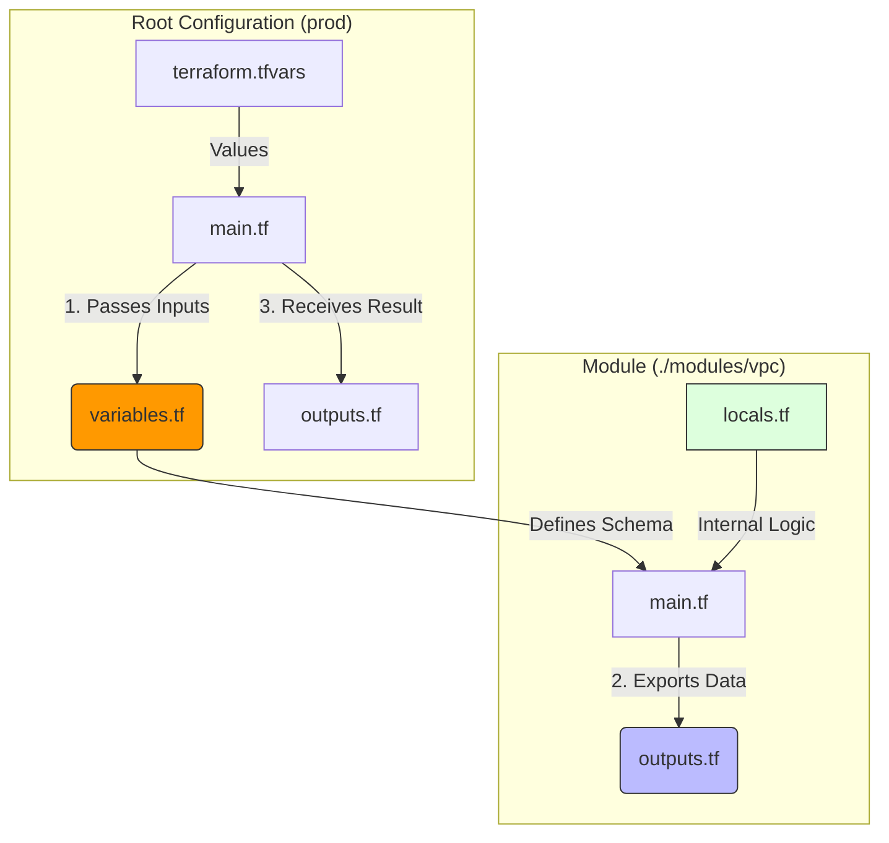
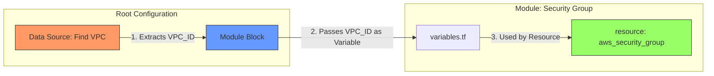
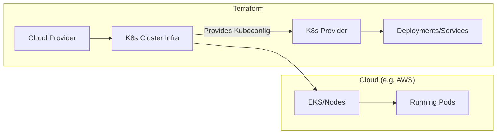

[Link to Hands On](terraform-handson.md)
[Link to Remote State](terraform-arch-remote-state.md)

# `Basic concept`
### Versioning
- **Terraform CLI Version:** Specified in the `required_version` block 
- **Provider Versioning:** Defined within the `required_providers` block. providers for major clouds (AWS, Azure, GCP), local services (Docker, Kubernetes), and even SaaS (Cloudflare, GitHub).
- **The Lock File (`.terraform.lock.hcl`):** Automatically generated during `terraform init`. It records the exact version of the providers used, ensuring every team member and CI/CD runner uses the same binary.
### Type
| Feature           | Collection Type                    | Structural Type                                    |
| ----------------- | ---------------------------------- | -------------------------------------------------- |
| **Members**       | list, map, set                     | object, tuple                                      |
| **Element Types** | All elements must be the same type | Elements can be different types                    |
| **Schema**        | Simple (one type for all values)   | Complex (each attribute/position has its own type) |
| **Length**        | Dynamic (any number of elements)   | Fixed (length is part of the type definition)      |
| **Example**       | `list(string)`                     | `object({ name=string, age=number })`              |

### Backend State
`terraform.tfstate` is the "source of truth" that maps your configuration to real-world resources.
- **Mapping:** map a specific ID in the cloud.
- **Local State:** Stored as a JSON file on your computer.
- **Remote State:** Stored in a shared location (like an S3 bucket or Terraform Cloud).

### Data vs Resource
In Terraform, the distinction lies in **ownership**: a `resource` owns the infrastructure (**create, update, or delete**), while a `data` source just visits it(**fetch information**, already exists).

| Feature       | `resource`                                | `data`                                                        |
| ------------- | ----------------------------------------- | ------------------------------------------------------------- |
| **Intent**    | Define and manage infrastructure.         | Fetch attributes of existing infra.                           |
| **Lifecycle** | `Create, Read, Update, Delete (CRUD)`.      | `Read-only`.                                                    |
| **Source**    | Defined by your HCL code.                 | Managed by another team, manual click, or AWS/Azure defaults. |
| **Impact**    | Changing code changes the infrastructure. | Changing code only changes how you reference the info.        |

**Senior Tip:** Use `data` sources to create "contracts" between teams. If the Networking team manages the VPC, your App team should use a `data` source to find the `vpc_id` rather than hardcoding it or trying to manage the VPC `resource` themselves.


Why use `data` instead of keeping everything in one repo?

1\. **Separation**: Prevent network setting, accidentally destroy the entire stack
2\. **Clear Ownership** (RBAC)
- **Networking Team:** Has "Write" access to the Producer repo.
- **App Team:** Has "Read-Only" access to the Producer's resources (via data sources) but "Write" access to their own App repo.
3\. Execution **Speed** && Avoiding **"State Locking"**
A repo with 1,000 resources is slow. By splitting them, the App team only manages 50 resources, making their `plan` and `apply` cycles much faster.
4\. Decoupling Lifecycles
Network infrastructure (VPCs) usually lasts for years. Applications might be deployed 10 times a day. Using `data` sources allows the application to move at its own pace without requiring a full run of the core infrastructure code.

Senior Recommendation:

- Use **Tags** when teams are very separate and you want to maintain "Discovery" without sharing access to state files.
- Use **Remote State** when you own both repos or work in a tightly integrated platform team, as it provides a typed, programmatic contract between layers.

# `Module`
In Terraform, a **Module** is a container for multiple resources that are used together. Think of it as a "function" for infrastructure: you write the complex logic once, and call it multiple times with different parameters.

1\. The Module Structure

A standard module is usually stored in its own folder and contains:

- `main.tf`: The actual resources being created.
- `variables.tf`: The inputs (arguments) the module accepts.
- `outputs.tf`: The values the module returns to the caller.
- `locals.tf`: Internal logic and data transformation.

2\. How Folders Interact

- **Variables (Inputs):** The Root folder passes values into the module. The module cannot "see" the Root folder's variables unless they are explicitly passed.
- **Locals (Internal):** These are private to the folder they are in. A module's `locals` are not visible to the Root folder, and vice versa. They are used to keep code DRY (Don't Repeat Yourself).
- **Outputs (Return Values):** The Root folder can only access resource attributes from the module if the module explicitly "exports" them via an `outputs.tf` file.

3\. Visualizing the Interaction

This diagram shows how a **Root Configuration** interacts with a **VPC Module**.



4\. Code Example

**The Module (`./modules/s3_bucket/variables.tf`)**

```hcl
variable "bucket_name" {
  description = "Name of the bucket"
  type        = string
}
```

**The Module (`./modules/s3_bucket/main.tf`)**

```hcl
locals {
  # Internal logic: Ensure name is lowercase
  clean_name = lower(var.bucket_name)
}

resource "aws_s3_bucket" "this" {
  bucket = local.clean_name
}
```

**The Root Config (`./main.tf`)**

```hcl
module "app_storage" {
  source      = "./modules/s3_bucket"

  # Interaction: Passing a value into the module's variable
  bucket_name = "My-Prod-Data-Bucket" 
}

# Accessing the module's output later
resource "aws_s3_bucket_policy" "allow_access" {
  bucket = module.app_storage.bucket_id # Requires output "bucket_id" in module
}
```

Summary of Interaction Rules

1. **Scope:** Everything in a module is private by default.
2. **Locals vs Variables:** Use **variables** for things that change per environment (e.g., instance size). Use **locals** for things that are calculated or stay the same (e.g., naming conventions).
3. **Communication:** The `module` block in your root folder acts as the bridge. If it isn't in the `module` block, the data doesn't move.

To pass a **Data Source** result into a **Module**, you follow a three-step flow: Fetch in the Root, Pass via the Module block, and Receive via a Module Variable.

1\. Architectural Interaction

This flow ensures your module remains generic. Instead of the module searching for its own dependencies, the **Root Configuration** finds the dependency and "injects" it into the module.



2\. Code Implementation

The Root Configuration (`./main.tf`)

This is where the "Look-up" happens. We find an existing VPC and pass its ID into our custom Security Group module.

```hcl
# 1. Fetch the data
data "aws_vpc" "existing_vpc" {
  filter {
    name   = "tag:Name"
    values = ["production-vpc"]
  }
}

# 2. Inject data result into the module
module "web_sg" {
  source = "./modules/security_group"

  # We pass the ID attribute from the data source to the module's variable
  target_vpc_id = data.aws_vpc.existing_vpc.id
  service_name  = "web-server"
}
```

The Module Variable (`./modules/security_group/variables.tf`)

The module must have a "door" (variable) open to receive the data.

```hcl
variable "target_vpc_id" {
  type        = string
  description = "The ID of the VPC where the SG will be created"
}

variable "service_name" {
  type = string
}
```

The Module Logic (`./modules/security_group/main.tf`)

The module uses the injected data alongside its own internal **Locals** to create resources.

```hcl
locals {
  # Internal logic: Combine the passed variable with a hardcoded suffix
  sg_name = "${var.service_name}-sg"
}

resource "aws_security_group" "this" {
  name   = local.sg_name
  vpc_id = var.target_vpc_id # Using the value injected from the Root data source

  ingress {
    from_port   = 80
    to_port     = 80
    protocol    = "tcp"
    cidr_blocks = ["0.0.0.0/0"]
  }
}
```

Why this is the "Senior" way:

1. **Decoupling:** Your Security Group module doesn't care *how* the VPC was found. It just needs a string. This makes the module reusable for any VPC in any account.
2. **Validation:** By using `data` sources in the Root, Terraform will fail early (during `plan`) if the VPC doesn't exist, rather than failing halfway through an `apply`.
3. **Clean State:** It prevents the module from becoming "too heavy" by keeping the discovery logic in the Root and the creation logic in the Module.

# `State Lock`
To prevent state lock errors when multiple Terraform operations run simultaneously, use these methods:

1\. CI/CD `Concurrency` Controls

If you use automated pipelines, prevent multiple jobs from starting at the same time:

- **GitHub Actions:** Use the `concurrency` parameter in your workflow file to ensure only one job runs per environment.
- **GitLab CI:** Set a `resource_group` for your terraform jobs to serialize execution.

2\. Use **environment-scoped** GitHub concurrency control:

```yaml
concurrency:
  group: terraform-apply-dev  # ✅ Shared across ALL PRs
  cancel-in-progress: false   # Never interrupt applies
```

3\. State Splitting

Break large state files into smaller, logical components (e.g., `network`, `database`, `app`). This reduces the chance of two different changes requiring the same lock.

# `why convert to terraform is hard`
Moving from manual "ClickOps" to code is deceptively complex. As a senior, you aren't just running `terraform import`; you're managing architectural integrity and state drift.

1\. The "Import" Labor Trap

Using `terraform import` only brings the resource into the state file; it does **not** generate the HCL code for you.

- **The Struggle:** You must manually write HCL that perfectly matches the existing cloud configuration.
- **The Risk:** If your code misses a single default attribute, the next `terraform apply` might trigger a "destroy and recreate," causing unexpected downtime for production resources.

2\. Identifying "Golden" Defaults vs. Explicit Config

Cloud providers often assign default values (like specific encryption keys or network timeouts) that aren't visible in the console but are stored in the API.

- **The Difficulty:** Determining which attributes must be hardcoded in your Terraform files and which can be ignored.
- **Senior Approach:** Use tools like `terraformer` or the newer `import` blocks (introduced in Terraform 1.5) which allow for better code generation and planning before the state is modified.

3\. State Drift and Ghost Resources

Resources often have dependencies (IAM roles, security group rules, tags) that were created semi-automatically by the cloud provider.

- **The Difficulty:** Deciding where to draw the boundary. Do you import the underlying VPC, or just the EC2 instance?
- **The Risk:** "Ghost resources" left outside of Terraform management become technical debt that eventually breaks your automation.

4\. Refactoring and State Migration

Once resources are imported, they are often in a flat, messy state.

- **The Difficulty:** Moving those resources into clean, reusable **Modules** without Terraform thinking you deleted the old resource and created a new one.
- **The Solution:** Heavy use of `moved` blocks or `terraform state mv` to rename and reorganize addresses within the state file to match a professional directory structure.

5\. Managing Environment Parity

Existing resources in "Prod" rarely look exactly like those in "Staging" due to years of manual tweaks.

- **The Difficulty:** Creating a single, clean Terraform module that can handle these inconsistencies using variables and logic, rather than writing unique code for every environment.


# `Using Terraform to manage K8s`
To manage Kubernetes with Terraform, you typically split the work into two stages: **Infrastructure** (creating the cluster) and **Workload** (deploying your apps).

1\. The Architecture

You use two different providers:

- **Cloud Provider (e.g., AWS/Azure/GCP):** Creates the VPC, Control Plane, and Worker Nodes.
- **Kubernetes Provider:** Connects to that cluster to create Pods, Services, and Namespaces.



2\. Stage 1: Infrastructure (The Cluster)

First, you define the cluster. Using a module is the senior approach to handle the complex networking automatically.

**File: `eks.tf`**

```hcl
module "eks" {
  source  = "terraform-aws-modules/eks/aws"
  version = "~> 19.0"

  cluster_name    = "my-cluster"
  cluster_version = "1.27"
  vpc_id          = module.vpc.vpc_id
  subnet_ids      = module.vpc.private_subnets

  eks_managed_node_groups = {
    general = {
      instance_types = ["t3.medium"]
      min_size     = 1
      max_size     = 3
    }
  }
}
```

3\. Stage 2: Connecting the Providers

The Kubernetes provider needs the cluster's "address" and "credentials" to talk to it. You fetch these from the infrastructure module.

**File: `providers.tf`**

```hcl
provider "kubernetes" {
  host                   = module.eks.cluster_endpoint
  cluster_ca_certificate = base64decode(module.eks.cluster_certificate_authority_data)

  # Use cloud-specific exec for authentication
  exec {
    api_version = "client.authentication.k8s.io/v1beta1"
    command     = "aws"
    args        = ["eks", "get-token", "--cluster-name", module.eks.cluster_name]
  }
}
```

4\. Stage 3: Managing YAML Workloads

You have two main ways to handle your Kubernetes YAMLs:

Option A: Native Resources (Best for simple configs)

Terraform translates your YAML logic into HCL.

```hcl
resource "kubernetes_deployment" "app" {
  metadata {
    name = "web-server"
    labels = { App = "ScalableWeb" }
  }

  spec {
    replicas = 2
    selector {
      match_labels = { App = "ScalableWeb" }
    }
    template {
      metadata {
        labels = { App = "ScalableWeb" }
      }
      spec {
        container {
          image = "nginx:1.21"
          name  = "example"
        }
      }
    }
  }
}
```

Option B: The `kubernetes_manifest` Resource (Best for raw YAML)

If you already have `.yaml` files, you can import them directly without rewriting everything into HCL.

```hcl
resource "kubernetes_manifest" "service" {
  manifest = yamldecode(file("${path.module}/service.yaml"))
}
```

Why use Terraform for K8s instead of `kubectl`?

1. **Dependency Graph:** Terraform knows the cluster must exist before the Pod can be deployed. It handles the order automatically.
2. **Single State:** You can see exactly how a change in your Cloud Load Balancer (Infra) affects your Kubernetes Ingress (Workload).
3. **Cleanup:** `terraform destroy` removes the cluster **and** all the resources inside it cleanly.

**Senior Tip:** For complex apps, use the **Helm Provider** inside Terraform. It allows you to manage Helm charts as code while still keeping the lifecycle tied to your infrastructure.

## `Scan tool`
Both **Checkov** and **Trivy** are open-source security scanners used to "shift left" in DevOps, but they have different areas of expertise. **Checkov** specializes in deep infrastructure-as-code (IaC) policy enforcement, while **Trivy** is a versatile "all-in-one" scanner for containers and vulnerabilities.

Key Differences

| Feature              | Checkov                                              | Trivy                                                      |
| -------------------- | ---------------------------------------------------- | ---------------------------------------------------------- |
| **Primary Focus**    | Deep IaC Analysis & Cloud Policies                   | Vulnerability Scanning (CVEs) & Versatility                |
| **Scanning Scope**   | Terraform, CloudFormation, Kubernetes, Helm, Secrets | Container Images, OS Packages, Language Deps, IaC, Secrets |
| **Custom Policies**  | Written in Python or YAML                            | Written in Rego (Open Policy Agent)                        |
| **Secret Detection** | Can verify secrets against live APIs                 | Pattern-based (Regex) detection                            |
| **Speed**            | Moderate (slower due to graph-based logic)           | Very fast and lightweight                                  |

When to Use Checkov

- **Infrastructure-First Teams:** If your primary concern is preventing complex misconfigurations in Terraform or CloudFormation.
- **Compliance Needs:** You need built-in mappings for frameworks like SOC2, HIPAA, or PCI-DSS.
- **Graph Analysis:** You need to check relationships between resources (e.g., "Is this IAM role attached to a public S3 bucket?").

When to Use Trivy

- **Container Security:** If your main goal is scanning Docker images for known vulnerabilities (CVEs) in system libraries and application packages.
- **Consolidated Scanning:** You want one tool to handle images, code dependencies (SCA), and basic IaC checks.
- **Kubernetes Native:** You want to scan live clusters for security risks using an operator.

Bottom Line

Use **Checkov** for robust, complex infrastructure policy enforcement. Use **Trivy** for fast, comprehensive vulnerability scanning of your entire application stack and containers. Many teams use **both** in their pipelines to cover all bases.


## `Debug`

### `graph`

```

t plan -out=tfplan && t show -json tfplan > plan.tfgraph

```

### `print debug`

```

TF_LOG=TRACE terraform plan 2>&1 | awk '{$1=""; print $0}' > debug_no_timestamp.log

TF_LOG=DEBUG terraform plan -out=tfplan > log_plan.txt 2> log_debug.txt

```

### `use tfstate`

```

t state list

t state show 'docker_container.nginx["tutorial-1"]'

```
### use t show to get all resource status
```
terraform show -json
```