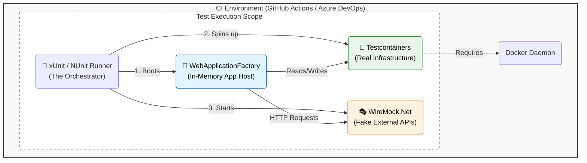

## Playwright
| Strategy              | Key Action                                                           | Benefit                                                         |
| --------------------- | -------------------------------------------------------------------- | --------------------------------------------------------------- |
| **Local Development** | Run tests in IDE (VS Code) and use Codegen to record scripts.        | Catch bugs instantly before pushing code to the repository.     |
| **Network Mocking**   | Simulate API responses and handle error states (e.g., 404, 500).     | Test the UI in isolation without waiting for a stable backend.  |
| **CI/CD Integration** | Automate tests on every Pull Request using sharding and parallelism. | Prevents broken code from being merged into the main branch.    |
| **Component Testing** | Test individual React, Vue, or Svelte components directly.           | Validates small units of UI logic faster than full E2E tests.   |
| **Visual & A11y**     | Use screenshot comparisons and accessibility engines (axe-core).     | Ensures design consistency and compliance during development.   |
| **Rapid Debugging**   | Use the Trace Viewer to inspect snapshots and network logs.          | Reduces time spent diagnosing failures with "time-travel" logs. |

## Pact

## How I can run integration Test in CI env without deploy
To run integration tests in C# without deploying, you should use WebApplicationFactory to host your API in-memory and Testcontainers to spin up real, ephemeral infrastructure (like SQL Server or Redis) directly within your test code.

The "No-Deploy" Architecture
### The Orchestrator (Test Runner)
The xUnit or NUnit runner - lifecycle management: starting the app, provisioning the containers, and tearing down.
### The Application Host (WebApplicationFactory)
runs your API entirely in in-memory. 
How it works: It creates a TestServer that runs your actual Program.cs startup logic.
### Real Infrastructure (Testcontainers)
This replaces "mocks" for things you own. The code commands Docker to pull a real SQL Server or Redis image, start it, and provide a connection string.
### The Impersonator (WireMock.Net)
This replaces 3rd party services (like Stripe or Twilio)

2. The Infrastructure: Testcontainers
For dependencies you own (Databases, Redis, RabbitMQ), do not use mocks or in-memory database providers, as they often fail to catch SQL-specific bugs. Use the Testcontainers library to programmatically spin up real Docker containers when your tests start and destroy them when they finish. 
CI Requirement: Your CI agent (GitHub Actions, Azure Pipelines) must have a valid Docker daemon running (Docker-in-Docker). 
3. External APIs: WireMock.Net
For dependencies you don't own (Stripe, Twilio, 3rd Party APIs), use WireMock.Net. It starts a lightweight HTTP server alongside your tests that acts as the external service. 
Why: It ensures your tests don't fail just because an external vendor is down or rate-limiting you. 
